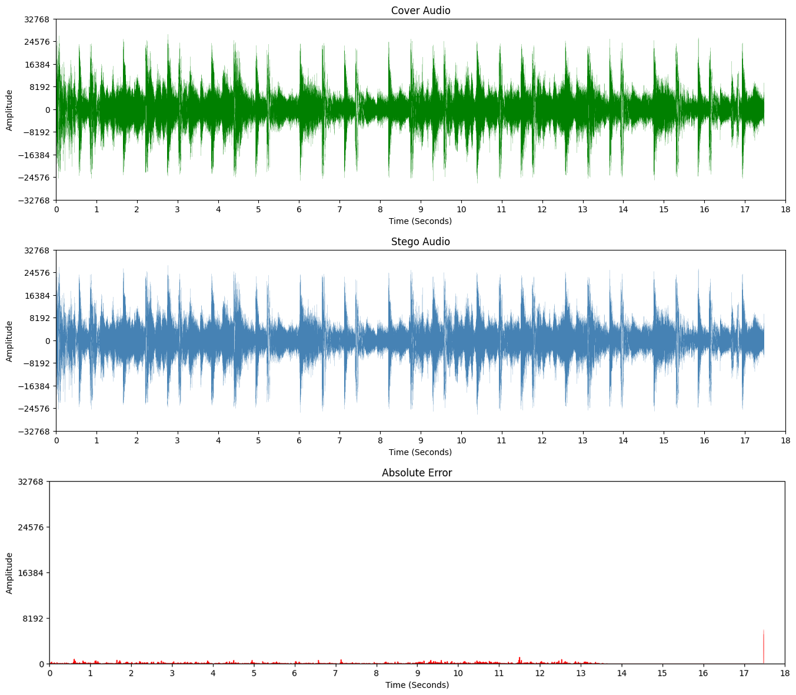
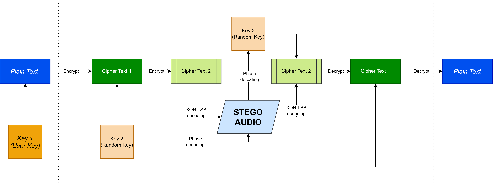

<h1 style="text-align: center; font-weight: bold; color: white; text-decoration: underline; font-variant: small-caps;">Data Obfuscation and Security using<br/>Multi-algorithm encryption and Audio Steganography</h1>

[](https://multi-algo-steganography.streamlit.app)

A novel algorithm to hide payload information in an audio file, while also
securing its contents, using multi-algorithm encryption, XOR-based LSB
embedding, and Phase Coding.

[Click here](https://multi-algo-steganography.streamlit.app) for an interactive front-end demo.

# **Results**

The model achieves very good steganographic output, i.e. the presence of encoded
data is **not perceptible to human ears**.

As an example, a long message is encoded into a 17.5 seconds audio using this
novel algorithm. The first graph shows the waveform of the original audio, and
the second graph shows the waveform after the encoding process. The third graph
shows the difference between these two waveforms, to quickly visualize the
extent of changes.\
The third graph demonstrates that the introduced "noise" is very negligible.

|                Metric | % of max amplitude |
| --------------------: | -----------------: |
| Maximum error 99 %ile |          **1.32%** |
|         Average error |          **0.16%** |



Shown below is the process:



# **Environment setup**

This project has been tested with Python 3.13.

1.  Create an environment:

    ...using `conda`:

    ```bash
    conda create -n multi-algo-steganography python=3.13
    conda activate multi-algo-steganography
    pip install -r requirements.txt
    ```

    ...using `venv`:

    ```bash
    python -m venv venv
    venv/Scripts/activate
    pip install -r requirements.txt
    ```

    ...or using any other environment manager of your choice.

2.  You can see a sample usage of the module in the supplied
    [Jupyter Notebook](Notebook.ipynb), or launch the Streamlit app for an
    interactive frontend:

    ```bash
    streamlit run app.py
    ```
